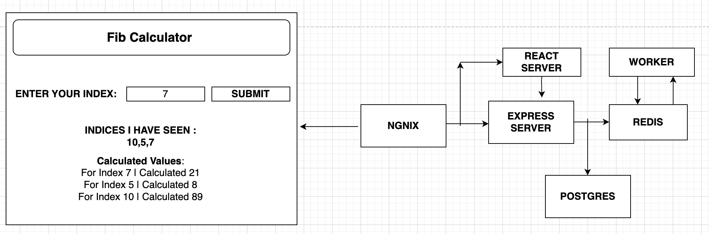

Fibonacci App Deployment with Docker:-

Overview This repository demonstrates the deployment of a Fibonacci app using Docker with multiple containers. The Fibonacci app calculates the Fibonacci value for a given index through a complex architecture involving multiple services.

Architecture:-

The architecture consists of several components that work together to handle user requests and calculate Fibonacci values:

a) Nginx Server:- The Nginx server acts as a gateway and performs routing to determine whether the user needs the React server (for HTML/JavaScript files) or the Express server (for backend API requests).

b) React Server:- The React server handles user interfaces and makes API requests to the Express server.

c) Express Server:- The Express server receives requests from the React server, processes them, and interacts with the PostgreSQL server.

d) PostgreSQL:- The PostgreSQL server stores a permanent list of indices.

e) Redis:- The Redis server stores all indices and their calculated values as key/value pairs. It acts as a caching layer and facilitates efficient retrieval of Fibonacci values.

f) Worker:- The Worker service watches Redis for new indices. When a new index is added, it calculates the Fibonacci value and updates Redis.

Fibonacci Calculation Workflow:-

User makes a request to the Nginx server with a specific index (e.g., 7).

Nginx routes the request to either the React server or the Express server based on the user's needs.

React Server (if required) sends an API request to the Express server with the specified index.

Express Server processes the request and interacts with the PostgreSQL server for a permanent list of indices.

Express Server stores the new index in Redis.

Worker continuously watches Redis for new indices.

If a new index is detected, the Worker calculates the Fibonacci value and updates Redis.

The final Fibonacci value for the given index is returned to the React server and then to the user.
